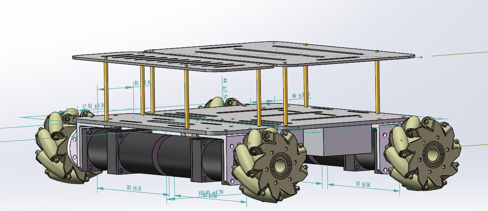
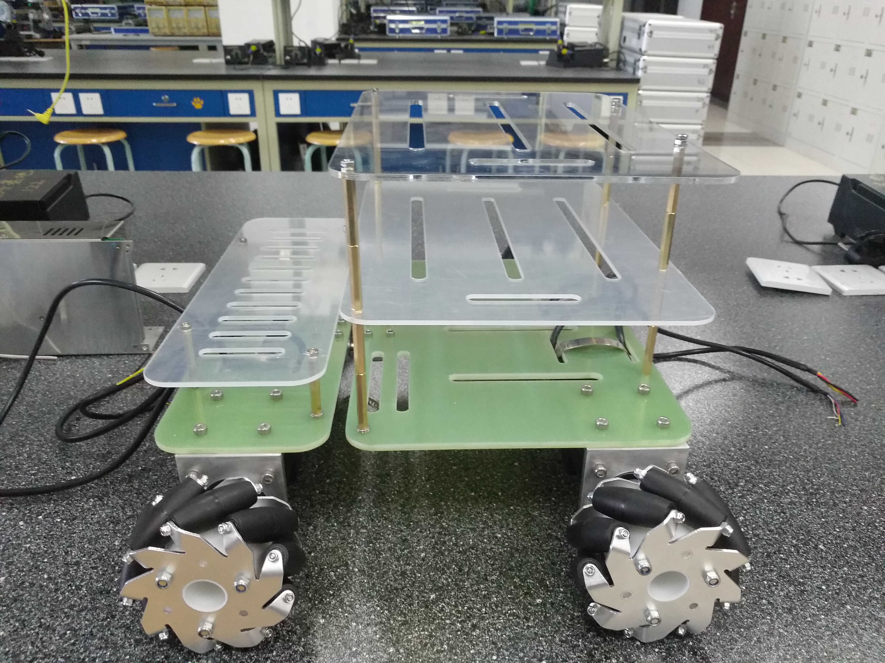
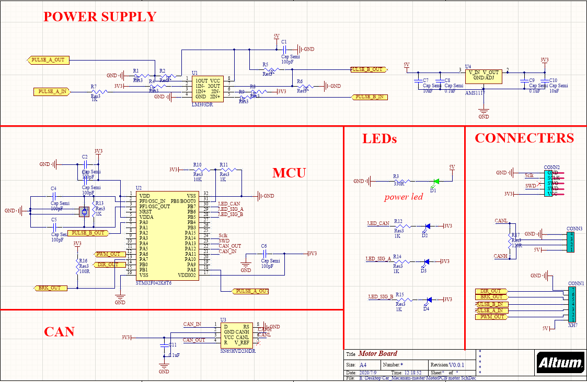
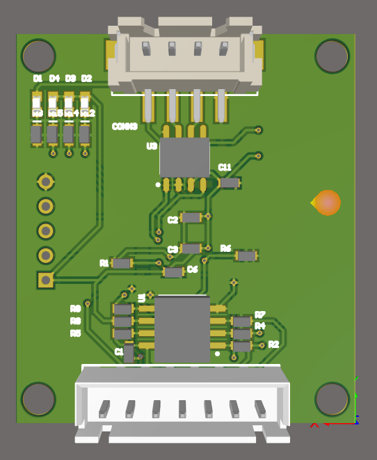
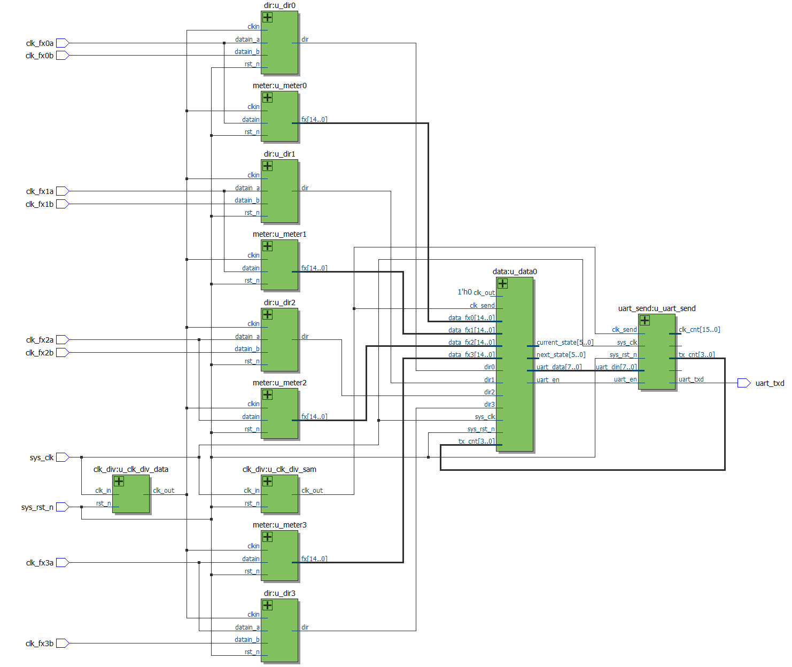

# Introduction 
- This experimental project is about building a mecanum mobile chassis from zero to one. The whole project contains mechanical design, PCB design, FPGA, and STM32 programming.
- The FPGA programmes are here: https://github.com/Bungehurst/FPGA_Mecanum_Car

<iframe width="560" height="315" src="https://www.youtube.com/embed/2ywz3Z1Y-V0" title="YouTube video player" frameborder="0" allow="accelerometer; autoplay; clipboard-write; encrypted-media; gyroscope; picture-in-picture; web-share" allowfullscreen></iframe>

# Mechanical Model

     
    

# PCB Design

     
    

# FPGA Design

    

